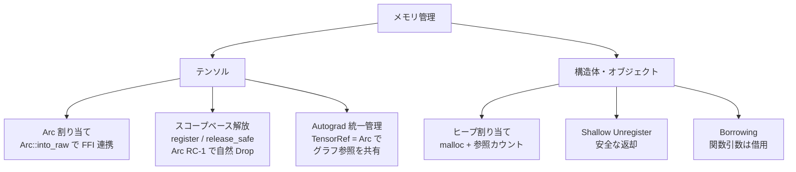
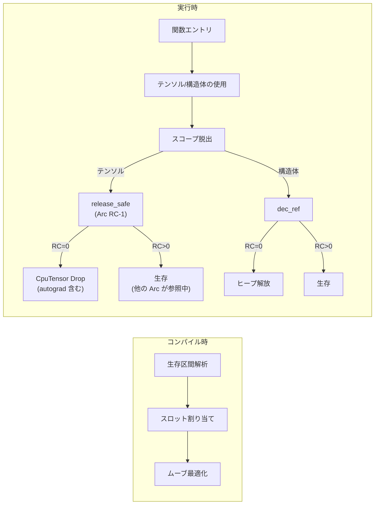

# TensorLogic メモリ管理 概要

本ドキュメントは TensorLogic のメモリ管理戦略を、全体像が把握できるように整理したものです。  
詳細な経緯や変更履歴は [MEMORY_MANAGEMENT_STRATEGY.md](./MEMORY_MANAGEMENT_STRATEGY.md) を参照してください。

---

## 全体像

TensorLogic のメモリ管理は **「テンソル」と「構造体」で異なる戦略** を採用していますが、テンソルの内部管理は **Arc (参照カウント)** で統一されています。



| 対象 | 割り当て | 解放トリガー | 主な最適化 |
|:-----|:---------|:-------------|:-----------|
| **テンソル** | Arc (参照カウント) | スコープ脱出 (Arc RC-1) | ゼロコスト割り当て、ムーブ最適化 |
| **構造体** | ヒープ (malloc) | 参照カウント = 0 | RVO/DPS、ムーブセマンティクス |
| **ZST** | なし (NULL) | なし (No-Op) | 割り当てゼロ、追跡ゼロ |

---

## 1. テンソルのメモリ管理

### 1.1 Arc ベースの割り当て

テンソルは **`Arc<UnsafeCell<CpuTensor>>`** で管理されます。

- テンソル生成時に `Arc::new(UnsafeCell::new(tensor))` → `Arc::into_raw` で生ポインタ化
- FFI 層では `*mut CpuTensor` として扱い、C-ABI 互換性を維持
- 解放時は `Arc::from_raw` で復元し、RC-1 → RC=0 で自然に Drop
- Autograd グラフの参照も同じ Arc で共有所有 (`TensorRef` = `Arc::clone`)

### 1.2 スコープベースの解放

テンソルはスコープ単位で管理されます。

```
関数 make_tensor() 内:
  1. テンソル生成 → 現在のスコープに登録 (tl_tensor_register)
  2. return 時 → 登録解除して「浮遊状態」に (tl_tensor_promote)
  3. スコープ脱出時 → 残っているテンソルを解放 (tl_tensor_release_safe)

呼び出し元 main() 内:
  4. 戻り値のテンソルを受け取り → 呼び出し元のスコープに登録
  5. スコープ脱出時 → 解放
```

> **不変条件**: `Struct("Tensor")` は `build_struct_gep` や `emit_struct_copy` に到達してはならない。Tensor は LLVM IR 上では不透明ポインタ (`ptr`) であり、ランタイム関数で排他的に管理される。

### 1.3 Autograd テンソルの Arc 統一管理

Autograd（自動微分）に参加するテンソルも、通常テンソルと **同じ Arc ベース** で管理されます。特別扱いは不要です。

- **`TensorRef = Arc<UnsafeCell<CpuTensor>>`**: GradFn 内の入力参照として使用
- **`tensor_ref_from_ptr()`**: FFI ポインタから `Arc::clone` で共有参照を取得 (RC+1)
- **`backward()` 完了時**: 出力テンソルの `grad_fn = None` で GradFn が Drop → 内部の TensorRef が Drop → 中間テンソルの RC が連鎖的に減少 → 不要なテンソルが自然に解放

> **不変条件**: Autograd テンソルもスコープ脱出時に `tl_tensor_release_safe` → `Arc::from_raw` で RC-1 される。RC=0 でデータも autograd グラフも一括 Drop。

---

## 2. 構造体のメモリ管理

### 2.1 参照カウント

構造体はヒープに `malloc` で確保し、**参照カウント (RefCount)** で管理します。

```
生成: Point { x: a }
  → フィールドに対し deep_clone (ptr_acquire) → RC 増分
  → ローカル変数 a: RC=1, 構造体フィールド .x: RC=2

スコープ脱出:
  → ローカル変数 a の RC をデクリメント → RC: 2→1
  → 構造体側の参照は生存

返却 (Shallow Unregister):
  → 構造体コンテナを unregister (再帰なし)
  → フィールドは exit_scope のデクリメントで RC=1 に
  → コンテナもフィールドも RC>0 で安全に返却
```

### 2.2 関数引数: 借用 (Borrowing)

関数引数は **呼び出し元が所有** しているとみなし、被呼者は参照カウントを操作しません。

- 引数に対する `register` / `inc_ref` は**行わない**
- 再代入時: 古い値はデクリメントしない（所有していないため）、新しい値は通常通り登録
- 返却や構造体への格納: 明示的な `tl_ptr_acquire` で借用→所有に昇格

### 2.3 戻り値の最適化 (RVO / DPS)

呼び出し元が戻り値スロットを事前確保し、ポインタ (`*dest`) を渡す **Destination Passing Style**。

- 呼び出し先は結果を直接 `*dest` に構築
- `inc_ref` は一切発生しない
- 大きな構造体もゼロコピーで返却

### 2.4 ムーブセマンティクス

変数の**最後の使用時**には `inc_ref` を省略して所有権を移動します。

- コンパイラの生存区間解析で「最後の使用」を特定
- 元の変数はスコープ終了時にデクリメントされない
- `inc_ref` / `dec_ref` のペアが削減され、深い呼び出しチェーンで高速化

---

## 3. 特殊ケース

### 3.1 ゼロサイズ型 (ZST)

`struct Empty {}` のようなフィールドのない構造体は **NULL ポインタ** として扱います。

- コンパイラ: `compile_struct_init` で `i8* null` を返し、`malloc` をスキップ
- ランタイム: `inc_ref`/`dec_ref`/`register`/`release` は `ptr == NULL` で即座に No-Op
- 二重解放は不可能、追跡コストもゼロ

### 3.2 GPU メモリ (Persistent Pool)

Metal デバイスでは GPU メモリの確保/解放の繰り返しが RSS 膨張を引き起こすため、**解放しない戦略** を採用しています。

- `release()`: テンソルのコンテンツ（Arc 等）はドロップするが、構造体メモリはリークさせる
- プロセス終了時に OS が回収
- `TL_GPU_PREALLOCATE_MB` 環境変数で事前確保を制御（将来実装）

---

## 4. 管理フロー図


